# 現在のデータ構造分析

## 現在の階層構造

```mermaid
graph TD
    %% 会社レベル
    C[Empire Art 会社]
    
    %% レイヤーレベル  
    L1[デフォルト事業レイヤー<br/>7件のエンティティ]
    L2[事業レイヤー<br/>2件のエンティティ]
    L3[あレイヤー<br/>3件のエンティティ]
    L4[新しいコンテナ<br/>3件のエンティティ]
    L5[空のレイヤー×3]
    
    %% 事業レベル
    B1[AGA事業<br/>attribute: 自分のID]
    B2[AIM事業<br/>attribute: 自分のID]  
    B3[BEAUTY ROAD事業<br/>attribute: 自分のID]
    B4[D2C事業<br/>attribute: 自分のID]
    B5[Webサービス事業<br/>attribute: 自分のID]
    B6[コンサルティング事業<br/>attribute: 自分のID]
    B7[新しい事業<br/>attribute: 自分のID]
    
    %% 業務レベル（すべてlayer_idのみ、business_id = NULL）
    T1[BRメディア<br/>business_id: NULL]
    T2[BR研修<br/>business_id: NULL]
    T3[BR SaaS<br/>business_id: NULL]
    T4[新しい業務×7<br/>business_id: NULL]
    
    %% 実行者レベル
    E1[あ<br/>task: BR研修]
    E2[あ<br/>task: BRメディア]
    E3[ええ<br/>task: BR研修]
    E4[新しい実行者×3<br/>task_id: NULL]
    
    %% 関係性
    C --> L1
    C --> L2
    C --> L3
    C --> L4
    C --> L5
    
    L1 --> B1
    L1 --> B2
    L1 --> B3
    L1 --> B4
    L2 --> B5
    L2 --> B6
    L3 --> B7
    
    %% 業務はレイヤーに直接属している（事業を経由しない）
    L1 -.-> T1
    L1 -.-> T2
    L1 -.-> T4
    L3 -.-> T3
    L4 -.-> T4
    
    %% 実行者
    T1 --> E2
    T2 --> E1
    T2 --> E3
    
    %% 孤立した実行者（点線）
    L1 -.-> E4
    
    classDef problem fill:#ffebee,stroke:#f44336,stroke-width:2px
    classDef normal fill:#e8f5e8,stroke:#4caf50,stroke-width:2px
    classDef warning fill:#fff3e0,stroke:#ff9800,stroke-width:2px
    
    class T1,T2,T3,T4 problem
    class E4 problem
    class B1,B2,B3,B4,B5,B6,B7 normal
    class L1,L2,L3,L4 warning
```



## 問題の整理

### 🚨 重要な問題

1. **業務が事業に属していない**
   - 全10件の業務で `business_id = NULL`
   - 業務が直接レイヤーに属している
   - 事業ノードが孤立している状態

2. **実行者の孤立**
   - 3件の実行者で `task_id = NULL`
   - ドラッグ&ドロップで作成された

### 📋 現在の実際の構造

```
会社
├── レイヤー（コンテナ）
│   ├── 事業（表示されるが機能的に孤立）
│   ├── 業務（レイヤーに直接属する）
│   │   └── 実行者
│   └── 実行者（孤立、task_id = NULL）
```

### 🎯 理想の構造（当初の計画）

```  
会社
├── 事業（独立）
│   └── 業務（事業に属する）
│       └── 実行者
└── レイヤー（独立コンテナ）
```

## 移行の課題

現在の業務はすべて事業ではなくレイヤーに直接属しているため、「業務は必ず事業に属する」設計への移行には大幅なデータ再構築が必要です。