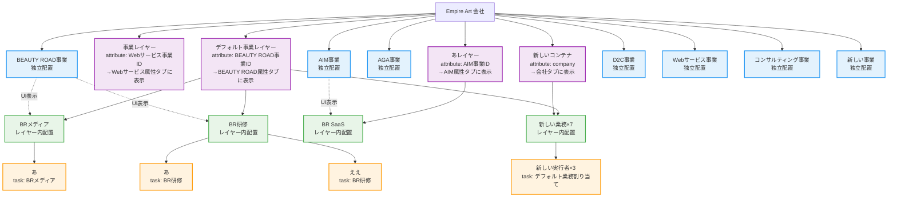

# 移行選択肢の比較

## 選択肢A: 現実的な設計変更（既存データ活用）

### 選択肢Aの特徴
- **データベース変更最小**: 既存の`layer_id`, `task_id`関係維持
- **UI/UX**: エッジで事業↔業務の関係を視覚的に表示
- **属性システム**: レイヤーの属性で表示タブを制御
- **実装コスト**: 低

---

## 選択肢B: 大幅なデータ移行（理想的な構造）

```mermaid
graph TD
    %% 会社レベル  
    C[Empire Art 会社]
    
    %% 事業（独立、内部に業務を含む）
    B1[AGA事業<br/>独立配置]
    B2[AIM事業<br/>独立配置]
    B3[BEAUTY ROAD事業<br/>独立配置] 
    B4[D2C事業<br/>独立配置]
    B5[Webサービス事業<br/>独立配置]
    B6[コンサルティング事業<br/>独立配置]
    B7[新しい事業<br/>独立配置]
    
    %% 業務（事業内に配置、business_id必須）
    T1[BRメディア<br/>business_id: BEAUTY ROAD]
    T2[BR研修<br/>business_id: BEAUTY ROAD]
    T3[BR SaaS<br/>business_id: AIM]
    T4[AGA業務1<br/>business_id: AGA]
    T5[AGA業務2<br/>business_id: AGA]
    T6[D2C業務1<br/>business_id: D2C]
    T7[Web業務1<br/>business_id: Webサービス]
    T8[Web業務2<br/>business_id: Webサービス]
    T9[コンサル業務1<br/>business_id: コンサルティング]
    T10[新事業業務1<br/>business_id: 新しい事業]
    
    %% 実行者（業務に属する）
    E1[あ<br/>task: BR研修]
    E2[あ<br/>task: BRメディア]  
    E3[ええ<br/>task: BR研修]
    E4[AGA実行者1<br/>task: AGA業務1]
    E5[D2C実行者1<br/>task: D2C業務1]
    E6[Web実行者1<br/>task: Web業務1]
    
    %% レイヤー（独立コンテナ、属性制御）
    L1[経営レイヤー<br/>attribute: company<br/>→会社タブ表示]
    L2[開発レイヤー<br/>attribute: Webサービス事業ID<br/>→Web属性タブ表示]
    L3[マーケレイヤー<br/>attribute: BEAUTY ROAD事業ID<br/>→BEAUTY属性タブ表示]
    
    %% 関係性
    C --> B1
    C --> B2
    C --> B3
    C --> B4
    C --> B5
    C --> B6
    C --> B7
    
    C --> L1
    C --> L2
    C --> L3
    
    B1 --> T4
    B1 --> T5
    B2 --> T3
    B3 --> T1
    B3 --> T2
    B4 --> T6
    B5 --> T7
    B5 --> T8
    B6 --> T9
    B7 --> T10
    
    T1 --> E2
    T2 --> E1
    T2 --> E3
    T4 --> E4
    T6 --> E5
    T7 --> E6
    
    classDef business fill:#e3f2fd,stroke:#2196f3,stroke-width:3px
    classDef layer fill:#f3e5f5,stroke:#9c27b0,stroke-width:2px
    classDef task fill:#e8f5e8,stroke:#4caf50,stroke-width:2px
    classDef executor fill:#fff3e0,stroke:#ff9800,stroke-width:2px
    
    class B1,B2,B3,B4,B5,B6,B7 business
    class L1,L2,L3 layer
    class T1,T2,T3,T4,T5,T6,T7,T8,T9,T10 task
    class E1,E2,E3,E4,E5,E6 executor
```

### 選択肢Bの特徴
- **データベース大幅変更**: `businesses.layer_id`削除、`tasks.layer_id`削除、`tasks.business_id`必須化
- **データ移行**: 全業務を適切な事業に再割り当て
- **UI/UX**: 事業↔業務の親子関係が明確
- **実装コスト**: 高

---

## 比較まとめ

| 項目 | 選択肢A | 選択肢B |
|------|---------|---------|
| 既存データ | ほぼ維持 | 大幅な再構築必要 |
| 実装工数 | 少 | 多 |
| 構造の明確さ | やや複雑 | 非常に明確 |
| リスク | 低 | 高 |
| 将来拡張性 | 中 | 高 |