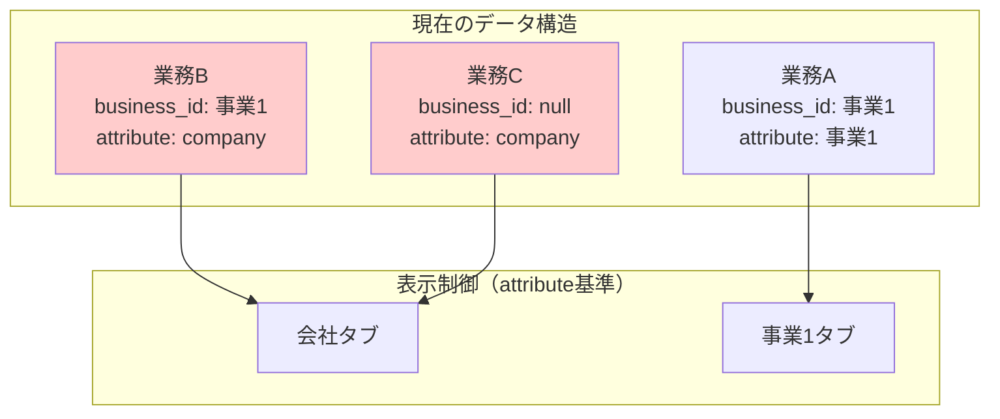
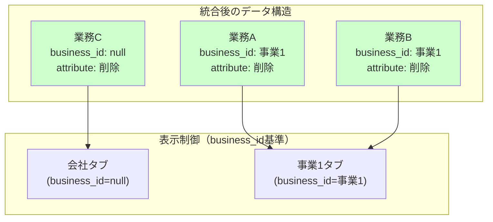
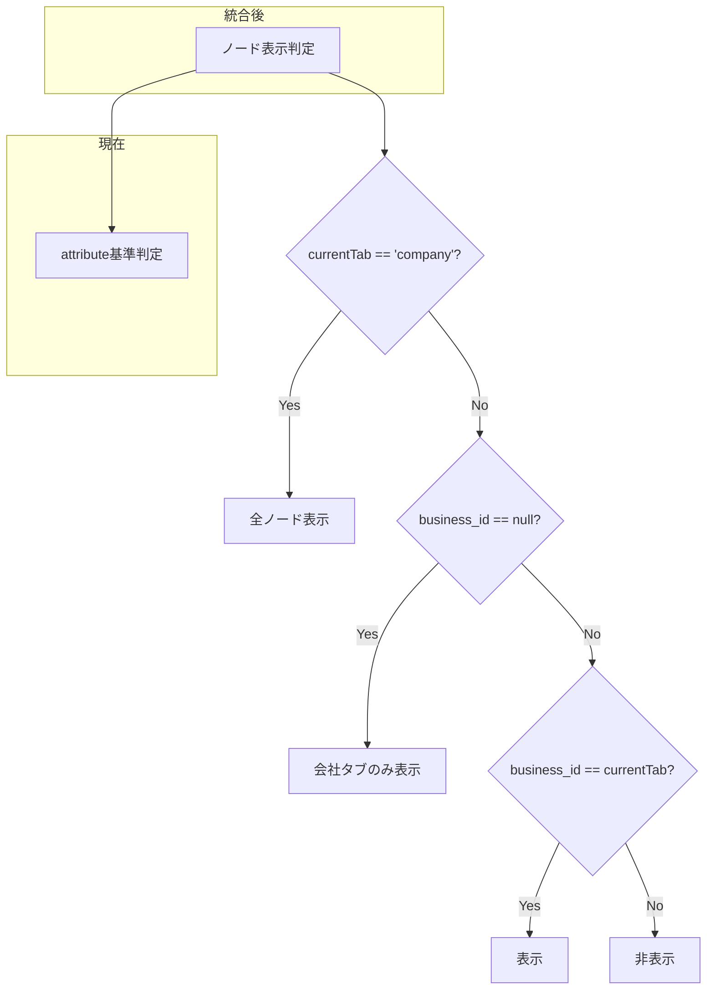
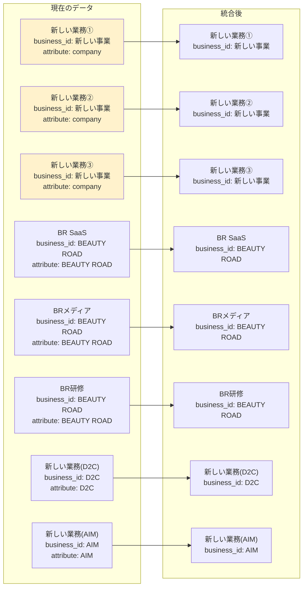

# business_id統合の全体像

## 🎯 統合の目的
attributeとbusiness_idの概念重複を解消し、business_id一本化でシンプルな設計にする。

## 現在の状態

## 統合後の理想状態

## 統合時の判定ロジック変更

## 現在のデータ状況（実際のデータ）

## 統合の主な変更点

### 1. データ構造の変更
- ✅ `attribute`カラム削除
- ✅ `business_id`のみで所属を管理
- ✅ `business_id=null` = 会社レベル

### 2. 表示制御の変更
- ✅ `shouldShowContainer`を`business_id`基準に変更
- ✅ タブ表示判定を`business_id`ベースに統一

### 3. UI変更
- ✅ EditModalで`business_id`選択（attributeの代わり）
- ✅ 自動設定ロジックを`business_id`ベースに変更

### 4. 影響を受ける業務
- **3つの「新しい業務」**: 会社タブ → 「新しい事業」タブに移動
- **その他7つの業務**: 変更なし（既に整合済み）

## 統合フェーズ

### Phase 1: 準備・設計検証 ✅
- 統合前テスト作成
- データ整合性確認
- 統合方針確定

### Phase 2: バックエンド統合 (進行中)
- 表示制御システム更新
- データ取得・保存処理更新

### Phase 3: UI統合
- EditModal更新
- InlineCardModal更新
- 自動設定ロジック更新

### Phase 4: データベース統合
- attributeカラム削除
- 型定義更新

### Phase 5: 最終検証
- 統合後テスト
- 動作確認

## データ品質確認結果

- ✅ **孤立Executor**: 0個
- ✅ **無効business_id**: 0個  
- ✅ **attribute-business_id不整合**: 0個
- ✅ **総業務数**: 10個
- ✅ **既に整合済み**: 7個
- ⚠️ **company属性だが事業所属**: 3個（統合対象）

## 期待される効果

1. **概念の簡素化**: attributeとbusiness_idの重複解消
2. **保守性向上**: 単一の責任（business_idのみ）
3. **バグ減少**: データ不整合のリスク軽減
4. **開発効率**: 新機能実装時の迷いが減る

この統合により、Vision-Boardの設計がよりシンプルで理解しやすくなります。